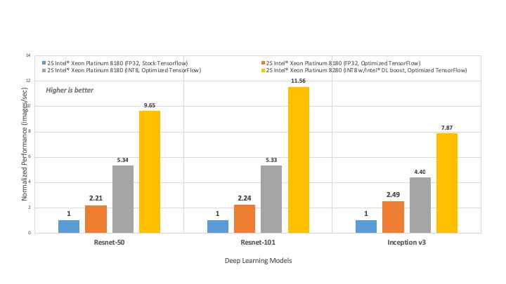

# Установка

Бла блаб

## Python

Бла бла бла

## SciPy

Для большинства задач вам понадобиться математические и инженерные библиотеки. Стэк самых популярных таких библиотек принято называть Scipy.

## Anaconda

Anaconda часто используют в проектах Data Science, Machine Learning и т.д. Во первых стандарнтый установщик пакетов и библиотек pip имеет недостаток, что в рамках исполняемой среды все пакеты устанавливаются глобально, то есть вы не сможете использовать разные версии библиотек под разные проекты, поэтому обычно создают отдельные вирутальные среды для каждого проекта. Каждая такая среда независима от других может содержать свои библиотеки с разными версиями. Anaconda Navigator дает возможность удобно создавать такие среды через интерфейс и просматривать устанавленные в них пакеты. По-мимо этого Anaconda поставляется со своим собственным установщиком пакетов `conda`. Это не значит, что нельзя использовать привычный менеджер пакетов `pip`, но в некоторых случаях `conda` может оказаться предпочтительнее, так как многие популярные пакеты были специально оптимизированы для работы друг с другом и откомпилированы с помощью Intel MKL, например известная библиотека `TensorFlow`. Пример выиграша в скорости работы на многоядреном процессеров между обычным `tensorflow` и откомлированым с помощью `Intel MKL` показан на рисунке 1.

## Jupyter Notebook/ Jupyter Lab

Jupyter Notebook — это удобный инстурмент для ведения вычислительных экспрериментов, вывод (в том числе и изображений) может осуществляться прямо в тетрадь, где на языке *Markdown* можно ввести текстовые заметки. Выполнять консольные команды, делиться тетрадями с другими исследователями, выкладывать в интернет.